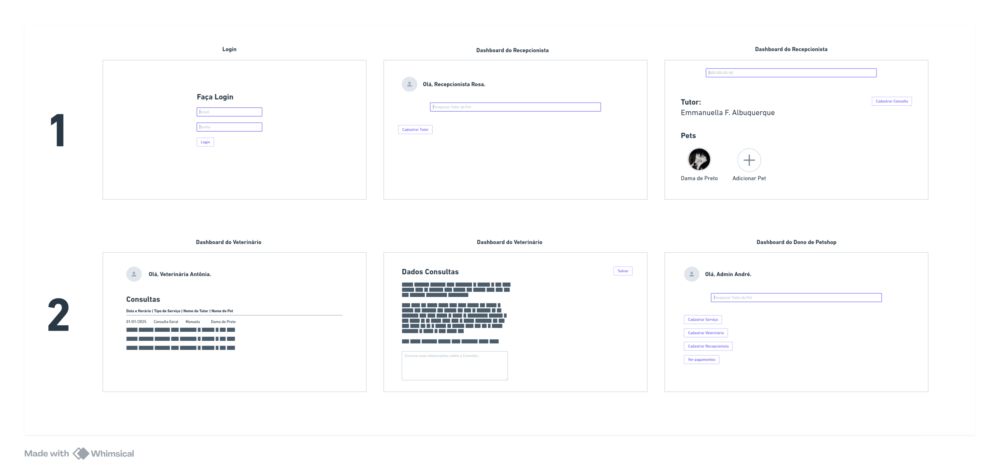

# 4Paws Frontend

## Protótipo MVP 4Paws 🐾🐕‍🦺


##  👩🏽‍💻⚙️ Tecnologias 
- Angular: 18.2.11
- Node: 22.11.0
- Package Manager: npm 10.9.0

## Como rodar?
```shell
# instala versão do node
nvm install v22.11.0
# seleciona para uso
nvm use 22.11.0
# verifica versão em uso
node -v
# instala última versão do angular cli
npm install -g @angular/cli
# verifica versão em uso do angular cli
ng version

# faz o clone do projetk
git clone git@github.com:EmmanuellaAlbuquerque/4-paws-frontend.git
# entra na pasta do projeto
cd 4-paws-frontend
# instala as dependências do projeto 
npm install
# roda o projeto. ele abre na url: localhost:4200
npm start
```

